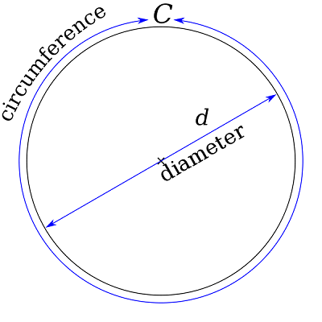
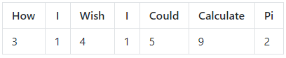

## Introduction

Calculate the value of π (pronounced "Pi") using the OctaPi distributed Raspberry Pi computer! You can complete most of this project with only a single Raspberry Pi, or any other computer running Python 3. Only the last part of the project requires an OctaPi (see the [Build an OctaPi](https://projects.raspberrypi.org/en/projects/rpi-python-build-an-octapi){:target="_blank"} resource).

### What you will make

The number π is the ratio of a circle's circumference to its diameter: 3.141592... It has been represented by the Greek letter π since the mid-18th century.

The value of π is often used in mathematics, physics, and engineering, but it is an **irrational number** and therefore it's hard to use its actual value in accurate calculations.

Finding the value of π is important for science and engineering, but it is also an intellectual puzzle that has entertained mathematicians for centuries.

### What you will learn
This resource covers elements from the following strands of the [Raspberry Pi Digital Making Curriculum](http://rpf.io/curriculum){:target="_blank"}:

+ [Apply higher-order programming techniques to solve real-world problems](https://curriculum.raspberrypi.org/programming/maker/){:target="_blank"}

### Licence

OctaPi: Calculating Pi by [GCHQ](https://www.gchq.gov.uk/){:target="_blank"} and the Raspberry Pi Foundation is licensed under a Creative Commons Attribution 4.0 International Licence.
Based on a work at [OctaPi: calculating Pi](https://github.com/raspberrypilearning/octapi-calculating-pi).

**Code and scripts copyright:**

[Crown Copyright](https://www.nationalarchives.gov.uk/information-management/re-using-public-sector-information/uk-government-licensing-framework/crown-copyright/){:target="_blank"}
License: [Apache 2](https://www.apache.org/licenses/LICENSE-2.0){:target="_blank"}
