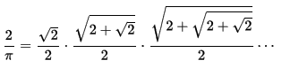
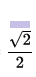
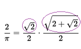
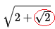

## Viète's method

In the 16th and 17th centuries, the calculation of π was revolutionised by **infinite series methods**, in which infinitely long series of calculations are used to progressively generate a more and more accurate approximation of π. The first series discovered in Europe was an infinite product series found by French mathematician François Viète in 1593. It achieved 15 digits in only 25 **terms** (i.e. steps in the series).

  

Let's take a closer look at this equation. Once you break it down into smaller parts, it becomes much easier to understand, and you'll be able to work out how to calculate it using a computer program. The dots between the fractions just mean **multiply**.

+ Open IDLE and create a new Python file. Call it `viete.py`.

    [[[rpi-gui-idle-opening]]]

Each term in the infinite series looks a bit like what you see below. You might have noticed that, in every term, you need to do a calculation involving a square root (marked in purple), and then divide the result by two.



+ Create a variable called `purple` to represent the square root part of the calculation, and set its value to the square root of 2.

--- hints ---
--- hint ---
To find the square root of a number in Python, you will need to import the `math` library at the start of your program:

```python
import math
```
--- /hint ---
--- hint ---
You can find the square root of a number using `math.sqrt()`. For example, here is code which will calculate the square root of 16:

```python
math.sqrt(16)
```
--- /hint ---
--- /hints ---

+ Create another variable called `answer` and set it to the value of the whole first term in the sequence — this will be the `purple` variable divided by 2.

You can check your code at this point by adding in a line to print the value of `answer` and checking that it equals `√2/2` or `0.7071067811865476`.

You have now calculated the value of the first term of the infinite series. However, this will not be a very precise approximation of 2/π. The more **iterations** (i.e. terms) of the series you perform, the more accurate the result becomes. Here are the first two terms in the infinite series:



To get a more accurate result, we need to follow these steps:

1. Calculate the value of the new `purple` section (in this case `√(2+√2)`)
1. Divide this by `2`
1. Multiply this result by the previous result

Let's first look at the `purple` section in more detail.



Have you noticed that the part circled in red (`√2`) is our previous purple calculation? To find the result of the new `purple` calculation, we can do this:

`new purple = square root of ( 2 + old purple )`

If you look at the next term of the sequence, you will see that this rule holds true: as long as we save the result of the `purple` calculation to use next time, we can keep calculating like this as many times as we like using a loop.


+ Create a loop which runs the steps to calculate the new and more precise answer 25 times, each time saving the value of the `purple` calculation and the new `answer`.

[[[generic-python-for-loop]]]

Notice that the end result of this calculation is equal to `2 / π`. We want to know just the value of π.

+ Rearrange this equation to obtain the value of π:

`2 / π = result`

--- hints ---
--- hint ---
Here is some pseudocode to help you write your program:

```Python
SET purple = √2
SET answer = purple/2

FOR i FROM 1 TO 25 DO
    SET purple = √ (2 + purple)
    SET answer = answer * (purple / 2)
    PRINT 2 / answer
END FOR

```

--- /hint ---
--- hint ---
Here is a solution in Python:

```Python
# Viete example
import math

purple = math.sqrt(2)
answer = purple/2

for i in range(25):
    purple = math.sqrt(2+purple)
    answer = answer * (purple / 2)

    print("Pi = " + str(2/answer) )

```
--- /hint ---

--- /hints ---
