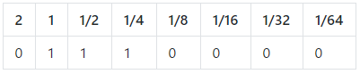
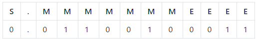
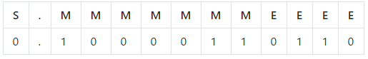

## Representing decimals on a computer

+ Run your π approximation program using Viète's infinite product series, but this time change the loop so that it runs 100 times.

You will notice that, as the number of iterations goes up, the reported results become more and more similar to one another.

**Why do you think this is?**

--- collapse ---
---
title: Answer
---
Viète's product series relies on calculating the product of many terms. After a while, the calculation accuracy decreases because of the precision with which the computer saves the results. The more iterations are used, the greater the impact of any inaccuracies caused by rounding errors.

--- /collapse ---

To understand why this is a particular problem when calculating an **irrational number**, you need to know how decimal numbers (numbers with a fractional part) are stored in a computer. You may already be familiar with the way positive integers are stored in binary, but if not, here's a recap:

[[[generic-theory-positive-integer-binary]]]

If we were to extend the binary place value headers to the _right_, they extend infinitely far with each new place value representing half the previous value:

With a fixed-point notation, there is a fixed amount of bits before and after the decimal point. So in this example, the number represented by 01110000 would be 1.75, which is `1 + 1/2 + 1/4`.

### Floating point representation

In Python, decimal numbers are represented using **floating-point** representation. You may have heard numbers like this be called "floats" — now you know why! Floating-point representation requires three things:

- A sign (+/-)
- A mantissa (the significant digits of the number)
- An exponent (the power to which the mantissa should be raised)

The exponent allows the point to be moved around (hence it is "floating") to accommodate storing a wide range of magnitudes of numbers, from the size of an atom to the mass of the sun! This concept is very similar to that of [standard form/scientific notation](https://www.mathsisfun.com/numbers/scientific-notation.html), which you might have encountered before.

### Representing a number in floating-point binary

Suppose you have 12 bits to store your floating point number in. The first of these represents the **sign**, or whether the number is positive (0) or negative (1). The next 7 digits represent the **mantissa** - these are the significant digits which make up the number. The floating point starts off between the sign and the mantissa. The final four bits might be the **exponent**, which is the power to which the mantissa should be raised, or in other words how many places the decimal point should be moved to the right.

To convert a floating-point binary number to denary:

+ Write down the bits representing the sign and the mantissa — `0.0110010`
+ Move the point to the right the number of places indicated by the exponent (in this case, `0011`, which is `3`) — the result is `0011.0010`
+ Calculate the binary numbers on each side of the decimal point separately. `0011 = 3`, and `0010 = 1/8` or `0.125` — the number is `3.125`

To convert a denary number to floating-point binary:

+ Write the whole part in binary, followed by a point, e.g. 011
+ After the whole part, write the fractional part in binary, e.g. 011.0010
+ Move the point all the way to the left, counting how many places it is moved
+ The number of places moved is the exponent, which you write in four bits at the end — .011 0010 0011
+ Before the point, add a sign bit to determine whether the number is positive or negative — 0.01100100011

**Convert the number 0.10000110110 to denary**

--- collapse ---
---
title: Answer
---

- Write down the sign and mantissa: `0.1000011`
- Move the point six (`0110`) places to the right: `0100001.1`
- Calculate the whole part: `0100001 = 32 + 1 = 33`
- Calculate the fractional part: `.1 = 0.5`

The result is 33.5

--- /collapse ---

**Why can't you write the number 33.125 in 12-bit format?**

--- collapse ---
---
title: Answer
---
In the previous example, we moved the floating point six places to the right. This meant that there was only one bit of the mantissa available to represent the fractional part of the number, so the highest precision available for the fractional part of the number was the nearest `0.5`. To represent a fractional part with greater precision would require a larger mantissa and therefore more bits to store the number in.

If you do a calculation in Python where the result has a greater degree of precision than the number of bits available to store it, the number will be approximated by rounding. This is what causes the Viète program to become more and more unreliable — there are not enough bits available to store the increasingly precise value of π.

--- /collapse ---

In Python, floating-point numbers are stored in 64 bits — as standard double-precision floating point numbers. The more bits you have available, the more precisely you can store the value of the float without rounding.

**How many bits would you need to store an irrational number like π?**

--- collapse ---
---
title: Answer
---
As we learnt from the definition of an **irrational number**, the decimal part is infinitely long and never repeats. We can never accurately store the value of π in a variable in Python because that would require an infinite number of bits!

Using the Python `decimal` module largely removes this problem because it allows you to specifiy arbitrary precision (or more accurately, user-defined integer precision). However, the precision is still limited by the amount of available memory. In other words, you can only specify finite precision: `getcontext().prec('x')`, where `x` is a finite integer.

As an extension task, you could use the [`decimal` module](https://docs.python.org/3/library/decimal.html?highlight=decimal#module-decimal){:target="_blank"} to improve the accuracy of your program. Can you achieve the 15 digits of accuracy after 25 iterations? How many terms in the series can you reach before accuracy is lost?

Take a look at our [example program](resources/pi_viete.py) to see an implementation of the Viète infinite product series using Python's `decimal` module.

--- /collapse ---
