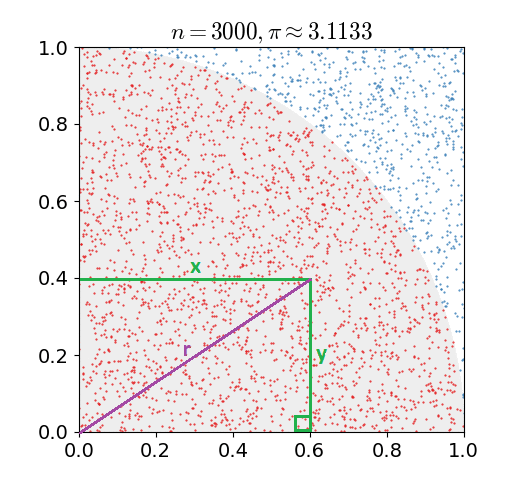

## Monte Carlo method

Now we will try a **Monte Carlo** method for calculating π to see how this technique compares. The Monte Carlo method we will use is called the **dartboard method**.

- A quarter circle with a radius of 1 is drawn inside in a 1×1 square
- Random points are generated that fall inside the square, rather like darts being thrown at a dart board
- The random points can be used to estimate the two areas by seeing how many fall in each section (inside or outside the circle)

_By nicoguaro (Own work) [CC BY 3.0](http://creativecommons.org/licenses/by/3.0), via Wikimedia Commons_

The ratio of the number of points inside the quarter circle to the total number of points will approximately equal π/4.

--- collapse ---
---
title: How did you calculate this ratio?
---
Let `r` be the radius of the circle. The `∝` symbol means "proportional to".

+ Points inside the square `∝ r²`
+ Points inside the quarter circle `∝ (πr²)/4` (the area of a quarter of the circle)

So the ratio of points inside : points outside is `(πr²)/4 : r²`

We can simplify `(πr²)/4 : r²`:
+ `πr² : 4r²` — multiply both sides by 4
+ `π : 4`     — divide both sides by r²
--- /collapse ---

The larger the number of randomly generated points, the more accurate the estimate of π.

### Calculating whether a point is inside the circle

Here is how we will determine whether a point lies inside the quarter circle:

- We already know that the radius of the circle is `1`
- For all points which lie inside the circle, `x² + y² < 1`, where x and y are points on the axes.

We can show that this is true using Pythagoras' theorem: `a² = b² + c²`.

- We already know the `x` and `y` positions of the randomly generated point
- We know that the radius of the circle is `1`
- We need to find the **radius**, i.e. the distance of the point from `x = 0, y = 0`. If the radius is less than `1`, the point is inside the circle.

_Adapted from original image by nicoguaro [CC BY 3.0](http://creativecommons.org/licenses/by/3.0), via Wikimedia Commons_

We can draw a right-angled triangle using the information we already have, since we know from Pythagoras' theorem that `r² = x² + y²`.
- Plug in the values of `x` and `y` into the equation. In this example, `r² = 0.6² + 0.4² = 0.36 + 0.16 = 0.52`.
- Normally we would need to take the square root of the result to get the radius. However, since the circle we are comparing against has a radius of 1, we can compare our `r²` result against the circle's `r²`: the circle's radius is `1`, meaning we are comparing our result to `1²`, which is also `1`. Therefore, we can just skip this step altogether for circles of radius 1.
- If the result is less than `1`, the point must be inside the circle. If it is `1` or greater, the point must be outside the circle.

**Calculate whether `x=0.81, y=0.62` is inside the circle**

--- collapse ---
---
title: Answer
---
- `r² = 0.81² + 0.62² = 0.6561 + 0.3844 = 1.0405`
Our condition for being inside the circle was `x² + y² < 1`. Therefore, this point is not inside the circle.
--- /collapse ---

We can implement this Monte Carlo method on a computer system, provided we have a suitable uniform random source of values between `0.0` and `1.0` for the `x` and `y` coordinates of the points.

We can write a program to generate lots of random co-ordinate points (`x, y`) in the square. Each set of points tested is called a **trial**. Let's see how the number of points in each trial and the number of trials affects the estimated value of π.
