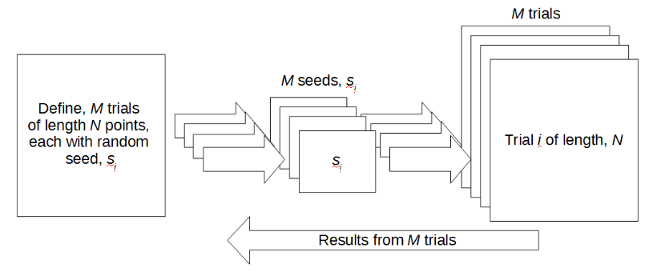
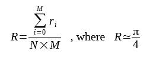
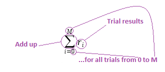
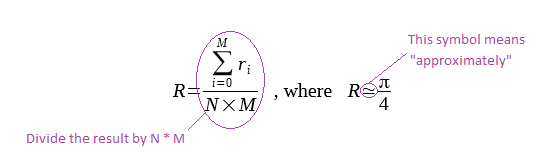

## Dartboard algorithm on a distributed system

Your standalone dartboard program demonstrates that the function for running jobs containing many random trials is working correctly. We will now use it to develop a distributed version for running on OctaPi servers from an OctaPi client.

  

  _Crown Copyright 2017_

### Implementing on a distributed system

In this implementation, we have M trials of `N` points so that the total number of points in the calculation of π is `M × N`.

The calculation uses M random seeds (s) for each trial. The result of each trial, r<sub>i</sub>, is the number of points that were inside the circle for trial i. The overall result, R, is therefore the sum of all the individual trial results, r<sub>i</sub>, divided by the total number of points in the square, `M × N`. Here's how this can be written as a mathematical formula:



This might look a bit scary, so let's break down what it means. This site has a [good explanation of sigma (the Σ symbol)](https://www.mathsisfun.com/algebra/sigma-notation.html){:target="_blank"}. Σ indicates that we have to sum up whatever comes after it.

 

 This formula represents the steps you included when you wrote the dartboard program in the previous programming challenge:
 - Ask for user inputs to define how many points (N) are tested in each trial, and how many trials (M) to run
 - Call the function you wrote M times, generating a new random seed for each time you call it
 - Add up the total values found 'inside' the circle

Now let's add the rest of the equation back in:

  

Adding the rest of the formula back in adds the final part of the programming challenge:
 - Then calculate `π = (4 × total_inside) / (N × M)`.

We have described it this way because this method allows us to break down a large number of trials into jobs that can, in theory, be run on many processors in parallel.

### Adapting the code

Reuse some of the **dartboard code from the previous challenge**, and adapt it to work with `Dispy` on OctaPi.

+ Create a new file and call it `dartboard_octapi.py`.

+ Copy the `compute` function from your standalone program into this file.

You need to add code to create a `Dispy` cluster on your OctaPi network to run your `compute` function.

+ Below the function, add some code to import the libraries and set up your cluster.

```python
import random, decimal, dispy

server_nodes ='192.168.1.\*'
cluster = dispy.JobCluster(compute, nodes=server_nodes)
```

This client code creates a `cluster` object using your `compute` function and points to servers on your network with the addresses specified.

+ Copy the code asking the user to input the number of trials and jobs, but rename your `no_of_trials` variable to `no_of_jobs`. In this version, each trial will be a job run on the cluster.

+ You now need a loop in order to create jobs. This loop will distribute the `compute` function with a random seed, `ran_seed`, to be run on the cluster `no_of_jobs` times. Your code might look like this:

```python
jobs = []
for i in range(no_of_jobs):
    # Schedule the execution of the `compute` function on one of the OctaPi nodes
    ran_seed = random.randint(0,65535) # Define a random seed for this job

    # Create a job
    job = cluster.submit(ran_seed, no_of_points)
    job.id = i # Associate an ID to the job

    # Add this job to the list of jobs
    jobs.append(job)
```

+ Finally, you need to collect the results from the jobs after they have completed, and calculate the total number of points that were inside the quarter circle.

```python
total_inside = 0
for job in jobs:
    inside = job() # Waits for job to finish and returns results

    total_inside += inside
```

+ Then, you can calculate the value of π, just as you did in the standalone version, except that you need to multiply `no_of_points` by `no_of_jobs`, as you have renamed the variable:

```python
total_no_of_points = no_of_points * no_of_jobs

# Override standard precision to avoid rounding problems
decimal.getcontext().prec = 100

# Calculate the estimated value of Pi
Pi = decimal.Decimal(4 * total_inside / total_no_of_points)
print(('The value of Pi is estimated to be %s using %s points' % (Pi, total_no_of_points) ))
```

--- /hints ---
--- /hint ---

Our version of this code is [here](resources/dartboard_octapi.py).

--- /hint ---
--- /hints ---

This code works well for moderately-sized computations, but the client machine may run out of memory, as each job that is running requires storage space on it. There is a technique to drip-feed jobs to the cluster shown in the `Dispy` documentation. A version of the same code using this more efficient method can be found [here](resources/compute_pi_efficient.py).
